# Agentic-AI - Auto-Generated Documentation

## Overview

# Agentic-AI

This repository contains AI-powered coding tools and projects, with a focus on the Jac programming language and advanced AI assistance for software development.

## Projects

## Installation

```bash
pip install agentic-ai
```

## Repository Structure

```
Agentic-AI/
```

## Architecture


### Key Components

- **Analytics**: Core component

- **DotEnvFormatter (extends argparse)**: Core component

- **YamlHelpFormatter (extends argparse)**: Core component

- **MarkdownHelpFormatter (extends argparse)**: Core component

- **GeniusAgent**: Core component

- **GeniusMode (extends GeniusAgent)**: Core component

- **ArchitectCoder (extends AskCoder)**: Core component

- **ArchitectPrompts (extends CoderPrompts)**: Core component

- **AskCoder (extends Coder)**: Core component

- **AskPrompts (extends CoderPrompts)**: Core component


### Class Hierarchy

- `DotEnvFormatter` extends `argparse`

- `YamlHelpFormatter` extends `argparse`

- `MarkdownHelpFormatter` extends `argparse`

- `GeniusMode` extends `GeniusAgent`

- `ArchitectCoder` extends `AskCoder`

- `ArchitectPrompts` extends `CoderPrompts`

- `AskCoder` extends `Coder`

- `AskPrompts` extends `CoderPrompts`

- `UnknownEditFormat` extends `ValueError`

- `MissingAPIKeyError` extends `ValueError`


### Module Dependencies

- `json`

- `sys`

- `mixpanel`

- `aider`

- `posthog`

- `pathlib`

- `time`

- `uuid`

- `packaging`

- `platform`


## API Reference


### Key Functions

- `compute_hex_threshold`

- `is_uuid_in_percentage`

- `__init__`

- `enable`

- `disable`

- `need_to_ask`

- `get_data_file_path`

- `get_or_create_uuid`

- `load_data`

- `save_data`

- `get_system_info`

- `_redact_model_name`

- `posthog_error`

- `event`

- `resolve_aiderignore_path`


## Call Graph (Main Interactions)


- **compute_hex_threshold** calls: format, threshold

- **is_uuid_in_percentage** calls: ValueError, compute_hex_threshold, not, threshold

- **__init__** calls: dumps, SingleWholeFileFunctionPrompts, configure_model_settings, text, Commands

- **enable** calls: Posthog, Mixpanel, get_system_info, disable

- **disable** calls: save_data

- **need_to_ask** calls: is_uuid_in_percentage

- **get_data_file_path** calls: home, mkdir, disable

- **get_or_create_uuid** calls: load_data, uuid4, save_data


## Code Context Graph (Module Diagram)

```mermaid

graph TD
  Analytics["📦 Analytics"]
  DotEnvFormatter["📦 DotEnvFormatter"]
  YamlHelpFormatter["📦 YamlHelpFormatter"]
  MarkdownHelpFormatter["📦 MarkdownHelpFormatter"]
  GeniusAgent["📦 GeniusAgent"]
  GeniusMode["📦 GeniusMode"]
  ArchitectCoder["📦 ArchitectCoder"]
  ArchitectPrompts["📦 ArchitectPrompts"]
  AskCoder["📦 AskCoder"]
  AskPrompts["📦 AskPrompts"]
  UnknownEditFormat["📦 UnknownEditFormat"]
  MissingAPIKeyError["📦 MissingAPIKeyError"]
  FinishReasonLength["📦 FinishReasonLength"]
  Coder["📦 Coder"]
  CoderPrompts["📦 CoderPrompts"]
  ChatChunks["📦 ChatChunks"]
  ContextCoder["📦 ContextCoder"]
  ContextPrompts["📦 ContextPrompts"]
  EditBlockCoder["📦 EditBlockCoder"]
  EditBlockFencedCoder["📦 EditBlockFencedCoder"]
  EditBlockFencedPrompts["📦 EditBlockFencedPrompts"]
  EditBlockFunctionCoder["📦 EditBlockFunctionCoder"]
  EditBlockFunctionPrompts["📦 EditBlockFunctionPrompts"]
  EditBlockPrompts["📦 EditBlockPrompts"]
  EditorDiffFencedCoder["📦 EditorDiffFencedCoder"]
  EditorDiffFencedPrompts["📦 EditorDiffFencedPrompts"]
  EditorEditBlockCoder["📦 EditorEditBlockCoder"]
  EditorEditBlockPrompts["📦 EditorEditBlockPrompts"]
  EditorWholeFileCoder["📦 EditorWholeFileCoder"]
  EditorWholeFilePrompts["📦 EditorWholeFilePrompts"]
  DotEnvFormatter -->|extends| argparse
  YamlHelpFormatter -->|extends| argparse
  MarkdownHelpFormatter -->|extends| argparse
  GeniusMode -->|extends| GeniusAgent
  ArchitectCoder -->|extends| AskCoder
  ArchitectPrompts -->|extends| CoderPrompts
  AskCoder -->|extends| Coder
  AskPrompts -->|extends| CoderPrompts
  UnknownEditFormat -->|extends| ValueError
  MissingAPIKeyError -->|extends| ValueError
  FinishReasonLength -->|extends| Exception
  ContextCoder -->|extends| Coder
  ContextPrompts -->|extends| CoderPrompts
  EditBlockCoder -->|extends| Coder
  EditBlockFencedCoder -->|extends| EditBlockCoder
  EditBlockFencedPrompts -->|extends| EditBlockPrompts
  EditBlockFunctionCoder -->|extends| Coder
  EditBlockFunctionPrompts -->|extends| CoderPrompts
  EditBlockPrompts -->|extends| CoderPrompts
  EditorDiffFencedCoder -->|extends| EditBlockFencedCoder
  EditorDiffFencedPrompts -->|extends| EditBlockFencedPrompts
  EditorEditBlockCoder -->|extends| EditBlockCoder
  EditorEditBlockPrompts -->|extends| EditBlockPrompts
  EditorWholeFileCoder -->|extends| WholeFileCoder
  EditorWholeFilePrompts -->|extends| WholeFilePrompts
  HelpCoder -->|extends| Coder
  HelpPrompts -->|extends| CoderPrompts
  DiffError -->|extends| ValueError
  ActionType -->|extends| str
  PatchCoder -->|extends| Coder
  PatchPrompts -->|extends| EditBlockPrompts
  SearchTextNotUnique -->|extends| ValueError
  SingleWholeFileFunctionCoder -->|extends| Coder
  SingleWholeFileFunctionPrompts -->|extends| CoderPrompts
  UnifiedDiffCoder -->|extends| Coder
  UnifiedDiffPrompts -->|extends| CoderPrompts
  UnifiedDiffSimpleCoder -->|extends| UnifiedDiffCoder
  UnifiedDiffSimplePrompts -->|extends| UnifiedDiffPrompts
  WholeFileCoder -->|extends| Coder
  WholeFileFunctionCoder -->|extends| Coder
  WholeFileFunctionPrompts -->|extends| CoderPrompts
  WholeFilePrompts -->|extends| CoderPrompts
  SwitchCoder -->|extends| Exception
  CaptureIO -->|extends| InputOutput
  CommandCompletionException -->|extends| Exception
  AutoCompleter -->|extends| Completer
  NoInsetCodeBlock -->|extends| CodeBlock
  LeftHeading -->|extends| Heading
  NoInsetMarkdown -->|extends| Markdown
  Model -->|extends| ModelSettings
  GitHubCopilotTokenError -->|extends| Exception
  OAuthCallbackHandler -->|extends| http
  ChdirTemporaryDirectory -->|extends| IgnorantTemporaryDirectory
  GitTemporaryDirectory -->|extends| ChdirTemporaryDirectory
  SoundDeviceError -->|extends| Exception
  ParentNodeTransformer -->|extends| ast
  SelfUsageChecker -->|extends| ast
  TheTest -->|extends| unittest
  TestCleanupTestOutput -->|extends| unittest
  TestCoder -->|extends| unittest
  TestCommands -->|extends| TestCase
  TestDeprecated -->|extends| TestCase
  TestUtils -->|extends| unittest
  UnknownError -->|extends| Exception
  TestFindOrBlocks -->|extends| unittest
  TestChatSummary -->|extends| TestCase
  TestInputOutput -->|extends| unittest
  TestInputOutputMultilineMode -->|extends| unittest
  TestInputOutputFormatFiles -->|extends| unittest
  TestLinter -->|extends| unittest
  TestMain -->|extends| TestCase
  TestModelInfoManager -->|extends| TestCase
  TestModels -->|extends| unittest
  TestOnboarding -->|extends| unittest
  TestReasoning -->|extends| unittest
  TestRepo -->|extends| unittest
  TestRepoMap -->|extends| unittest
  TestRepoMapTypescript -->|extends| unittest
  TestRepoMapAllLanguages -->|extends| unittest
  TestScriptingAPI -->|extends| unittest
  PrintCalled -->|extends| Exception
  TestSendChat -->|extends| unittest
  TestSSLVerification -->|extends| TestCase
  TestUnifiedDiffCoder -->|extends| unittest
  TestWholeFileCoder -->|extends| unittest
  TestBrowser -->|extends| unittest
  TestHelp -->|extends| unittest
  TestScrape -->|extends| unittest
  DebuggerTerminated -->|extends| Exception
  Debugger -->|extends| bdb
  JsIO -->|extends| io
  JsIO -->|extends| io
  DebuggerTerminated -->|extends| Exception
  JsIO -->|extends| io
  AppState -->|extends| TypedDict
  compute_hex_threshold -->|calls| format
  compute_hex_threshold -->|calls| threshold
  is_uuid_in_percentage -->|calls| ValueError
  is_uuid_in_percentage -->|calls| compute_hex_threshold
  is_uuid_in_percentage -->|calls| not
  __init__ -->|calls| dumps
  __init__ -->|calls| SingleWholeFileFunctionPrompts
  __init__ -->|calls| configure_model_settings
  enable -->|calls| Posthog
  enable -->|calls| Mixpanel
  enable -->|calls| get_system_info
  disable -->|calls| save_data

```



## Metadata

- **Repository Name**: Agentic-AI

- **Root Path**: C:\Users\ANONYM~1\AppData\Local\Temp\codegen_wm5bh6sk\Agentic-AI

- **Generated at**: C:\Users\ANONYM~1\AppData\Local\Temp\codegen_wm5bh6sk

- **Functions Analyzed**: 1477

- **Classes Analyzed**: 154

- **Function Calls Tracked**: 11518
