# gym - Auto-Generated Documentation

## Overview

[](https://pre-commit.com/) [](https://github.com/psf/black)

## Important Notice

### The team that has been maintaining Gym since 2021 has moved all future development to [Gymnasium](https://github.com/Farama-Foundation/Gymnasium), a drop in replacement for Gym (import gymnasium as gym), and Gym will not be receiving any future updates. Please switch over to Gymnasium as soon as you're able to do so. If you'd like to read more about the story behind this switch, please check out [this blog post](https://farama.org/Announcing-The-Farama-Foundation).

## Installation

```bash
pip install -r requirements.txt
```

**Key dependencies:**

- numpy>=1.18.0

- cloudpickle>=1.2.0

- importlib_metadata>=4.8.0; python_version < '3.10'

- gym_notices>=0.0.4

- dataclasses==0.8; python_version == '3.6'

## Repository Structure

```
gym/
```

## Architecture


### Key Components

- **Env (extends Generic)**: Core component

- **Wrapper (extends Env)**: Core component

- **ObservationWrapper (extends Wrapper)**: Core component

- **RelativePosition (extends gym)**: Core component

- **RewardWrapper (extends Wrapper)**: Core component

- **ClipReward (extends gym)**: Core component

- **ActionWrapper (extends Wrapper)**: Core component

- **DiscreteActions (extends gym)**: Core component

- **ContactDetector (extends contactListener)**: Core component

- **BipedalWalker (extends gym)**: Core component


### Class Hierarchy

- `Env` extends `Generic`

- `Wrapper` extends `Env`

- `ObservationWrapper` extends `Wrapper`

- `RelativePosition` extends `gym`

- `RewardWrapper` extends `Wrapper`

- `ClipReward` extends `gym`

- `ActionWrapper` extends `Wrapper`

- `DiscreteActions` extends `gym`

- `ContactDetector` extends `contactListener`

- `BipedalWalker` extends `gym`


### Module Dependencies

- `sys`

- `os`

- `gym`


## API Reference


### Key Functions

- `np_random`

- `np_random`

- `step`

- `reset`

- `render`

- `close`

- `unwrapped`

- `__str__`

- `__enter__`

- `__exit__`

- `__init__`

- `__getattr__`

- `spec`

- `class_name`

- `action_space`


## Call Graph (Main Interactions)


- **step** calls: do_simulation, _render, norm, Tuple, GetWorldVector

- **reset** calls: CreateStaticBody, _reset_simulation, _reinit_colors, reset_async, sample

- **render** calls: polygon, linspace, _render, set_mode, line

- **close** calls: array, close, destroy_window, ImageSequenceClip, Khmelnytska

- **__str__** calls: __unicode__, type

- **__exit__** calls: close

- **__init__** calls: min_action, max_action, _render, charset, pixels_only

- **__getattr__** calls: getattr, startswith, AttributeError


## Code Context Graph (Module Diagram)

```mermaid

graph TD
  Env["📦 Env"]
  Wrapper["📦 Wrapper"]
  ObservationWrapper["📦 ObservationWrapper"]
  RelativePosition["📦 RelativePosition"]
  RewardWrapper["📦 RewardWrapper"]
  ClipReward["📦 ClipReward"]
  ActionWrapper["📦 ActionWrapper"]
  DiscreteActions["📦 DiscreteActions"]
  ContactDetector["📦 ContactDetector"]
  BipedalWalker["📦 BipedalWalker"]
  LidarCallback["📦 LidarCallback"]
  BipedalWalkerHardcore["📦 BipedalWalkerHardcore"]
  Car["📦 Car"]
  Particle["📦 Particle"]
  FrictionDetector["📦 FrictionDetector"]
  CarRacing["📦 CarRacing"]
  ContactDetector["📦 ContactDetector"]
  LunarLander["📦 LunarLander"]
  LunarLanderContinuous["📦 LunarLanderContinuous"]
  AcrobotEnv["📦 AcrobotEnv"]
  CartPoleEnv["📦 CartPoleEnv"]
  Continuous_MountainCarEnv["📦 Continuous_MountainCarEnv"]
  MountainCarEnv["📦 MountainCarEnv"]
  PendulumEnv["📦 PendulumEnv"]
  AntEnv["📦 AntEnv"]
  AntEnv["📦 AntEnv"]
  AntEnv["📦 AntEnv"]
  HalfCheetahEnv["📦 HalfCheetahEnv"]
  HalfCheetahEnv["📦 HalfCheetahEnv"]
  HalfCheetahEnv["📦 HalfCheetahEnv"]
  Env -->|extends| Generic
  Wrapper -->|extends| Env
  ObservationWrapper -->|extends| Wrapper
  RelativePosition -->|extends| gym
  RewardWrapper -->|extends| Wrapper
  ClipReward -->|extends| gym
  ActionWrapper -->|extends| Wrapper
  DiscreteActions -->|extends| gym
  ContactDetector -->|extends| contactListener
  BipedalWalker -->|extends| gym
  LidarCallback -->|extends| Box2D
  FrictionDetector -->|extends| contactListener
  CarRacing -->|extends| gym
  ContactDetector -->|extends| contactListener
  LunarLander -->|extends| gym
  AcrobotEnv -->|extends| core
  CartPoleEnv -->|extends| gym
  Continuous_MountainCarEnv -->|extends| gym
  MountainCarEnv -->|extends| gym
  PendulumEnv -->|extends| gym
  AntEnv -->|extends| MuJocoPyEnv
  AntEnv -->|extends| MuJocoPyEnv
  AntEnv -->|extends| MujocoEnv
  HalfCheetahEnv -->|extends| MuJocoPyEnv
  HalfCheetahEnv -->|extends| MuJocoPyEnv
  HalfCheetahEnv -->|extends| MujocoEnv
  HopperEnv -->|extends| MuJocoPyEnv
  HopperEnv -->|extends| MuJocoPyEnv
  HopperEnv -->|extends| MujocoEnv
  HumanoidEnv -->|extends| MuJocoPyEnv
  HumanoidEnv -->|extends| MuJocoPyEnv
  HumanoidEnv -->|extends| MujocoEnv
  HumanoidStandupEnv -->|extends| MuJocoPyEnv
  HumanoidStandupEnv -->|extends| MujocoEnv
  InvertedDoublePendulumEnv -->|extends| MuJocoPyEnv
  InvertedDoublePendulumEnv -->|extends| MujocoEnv
  InvertedPendulumEnv -->|extends| MuJocoPyEnv
  InvertedPendulumEnv -->|extends| MujocoEnv
  BaseMujocoEnv -->|extends| gym
  MuJocoPyEnv -->|extends| BaseMujocoEnv
  MujocoEnv -->|extends| BaseMujocoEnv
  RenderContextOffscreen -->|extends| RenderContext
  Viewer -->|extends| RenderContext
  PusherEnv -->|extends| MuJocoPyEnv
  PusherEnv -->|extends| MujocoEnv
  ReacherEnv -->|extends| MuJocoPyEnv
  ReacherEnv -->|extends| MujocoEnv
  SwimmerEnv -->|extends| MuJocoPyEnv
  SwimmerEnv -->|extends| MuJocoPyEnv
  SwimmerEnv -->|extends| MujocoEnv
  Walker2dEnv -->|extends| MuJocoPyEnv
  Walker2dEnv -->|extends| MuJocoPyEnv
  Walker2dEnv -->|extends| MujocoEnv
  BlackjackEnv -->|extends| gym
  CliffWalkingEnv -->|extends| Env
  FrozenLakeEnv -->|extends| Env
  TaxiEnv -->|extends| Env
  Error -->|extends| Exception
  Unregistered -->|extends| Error
  UnregisteredEnv -->|extends| Unregistered
  NamespaceNotFound -->|extends| UnregisteredEnv
  NameNotFound -->|extends| UnregisteredEnv
  VersionNotFound -->|extends| UnregisteredEnv
  UnregisteredBenchmark -->|extends| Unregistered
  DeprecatedEnv -->|extends| Error
  RegistrationError -->|extends| Error
  UnseedableEnv -->|extends| Error
  DependencyNotInstalled -->|extends| Error
  UnsupportedMode -->|extends| Error
  ResetNeeded -->|extends| Error
  ResetNotAllowed -->|extends| Error
  InvalidAction -->|extends| Error
  APIError -->|extends| Error
  APIConnectionError -->|extends| APIError
  InvalidRequestError -->|extends| APIError
  AuthenticationError -->|extends| APIError
  RateLimitError -->|extends| APIError
  VideoRecorderError -->|extends| Error
  InvalidFrame -->|extends| Error
  DoubleWrapperError -->|extends| Error
  WrapAfterConfigureError -->|extends| Error
  RetriesExceededError -->|extends| Error
  AlreadyPendingCallError -->|extends| Exception
  NoAsyncCallError -->|extends| Exception
  ClosedEnvironmentError -->|extends| Exception
  CustomSpaceError -->|extends| Exception
  Box -->|extends| Space
  Dict -->|extends| Space
  Discrete -->|extends| Space
  GraphInstance -->|extends| NamedTuple
  Graph -->|extends| Space
  MultiBinary -->|extends| Space
  MultiDiscrete -->|extends| Space
  Sequence -->|extends| Space
  Space -->|extends| Generic
  Text -->|extends| Space
  Tuple -->|extends| Space
  MissingKeysToAction -->|extends| Exception
  AsyncState -->|extends| Enum
  AsyncVectorEnv -->|extends| VectorEnv
  SyncVectorEnv -->|extends| VectorEnv
  VectorEnv -->|extends| gym
  VectorEnvWrapper -->|extends| VectorEnv
  AtariPreprocessing -->|extends| gym
  AutoResetWrapper -->|extends| gym
  ClipAction -->|extends| ActionWrapper
  LegacyEnv -->|extends| Protocol
  EnvCompatibility -->|extends| gym
  PassiveEnvChecker -->|extends| gym
  FilterObservation -->|extends| gym
  FlattenObservation -->|extends| gym
  FrameStack -->|extends| gym
  GrayScaleObservation -->|extends| gym
  HumanRendering -->|extends| gym
  NormalizeObservation -->|extends| gym
  NormalizeReward -->|extends| gym
  OrderEnforcing -->|extends| gym
  PixelObservationWrapper -->|extends| gym
  RecordEpisodeStatistics -->|extends| gym
  RecordVideo -->|extends| gym
  RenderCollection -->|extends| gym
  RescaleAction -->|extends| gym
  ResizeObservation -->|extends| gym
  StepAPICompatibility -->|extends| gym
  TimeAwareObservation -->|extends| gym
  TimeLimit -->|extends| gym
  TransformObservation -->|extends| gym
  TransformReward -->|extends| RewardWrapper
  VectorListInfo -->|extends| gym
  LegacyEnvExplicit -->|extends| LegacyEnv
  LegacyEnvImplicit -->|extends| gym
  RegisterDuringMakeEnv -->|extends| gym
  ArgumentEnv -->|extends| gym
  NoHuman -->|extends| gym
  NoHumanOldAPI -->|extends| gym
  NoHumanNoRGB -->|extends| gym
  ArgumentEnv -->|extends| core
  UnittestEnv -->|extends| core
  UnknownSpacesEnv -->|extends| core
  OldStyleEnv -->|extends| core
  NewPropertyWrapper -->|extends| core
  GenericTestEnv -->|extends| gym
  KeysToActionWrapper -->|extends| gym
  DummyWrapper -->|extends| VectorEnvWrapper
  UnittestSlowEnv -->|extends| gym
  CustomSpace -->|extends| gym
  CustomSpaceEnv -->|extends| gym
  AtariTestingEnv -->|extends| GenericTestEnv
  DummyResetEnv -->|extends| gym
  FakeEnvironment -->|extends| gym
  FakeEnvironment -->|extends| gym
  FakeEnvironment -->|extends| gym
  DummyRewardEnv -->|extends| gym
  FakeEnvironment -->|extends| gym
  FakeArrayObservationEnvironment -->|extends| FakeEnvironment
  FakeDictObservationEnvironment -->|extends| FakeEnvironment
  OldStepEnv -->|extends| gym
  NewStepEnv -->|extends| gym
  BrokenRecordableEnv -->|extends| gym
  UnrecordableEnv -->|extends| gym
  step -->|calls| do_simulation
  step -->|calls| _render
  step -->|calls| norm
  reset -->|calls| CreateStaticBody
  reset -->|calls| _reset_simulation
  reset -->|calls| _reinit_colors
  render -->|calls| polygon
  render -->|calls| linspace
  render -->|calls| _render
  close -->|calls| array
  close -->|calls| close
  close -->|calls| destroy_window
  __str__ -->|calls| __unicode__
  __str__ -->|calls| type

```



## Metadata

- **Repository Name**: gym

- **Root Path**: C:\Users\ANONYM~1\AppData\Local\Temp\codegen_3nw6xeod\gym

- **Generated at**: C:\Users\ANONYM~1\AppData\Local\Temp\codegen_3nw6xeod

- **Functions Analyzed**: 1253

- **Classes Analyzed**: 178

- **Function Calls Tracked**: 6678
