# httpx - Auto-Generated Documentation

## Overview

<p align="center">
  <a href="https://www.python-httpx.org/"></a>
</p>

<p align="center"><strong>HTTPX</strong> <em>- A next-generation HTTP client for Python.</em></p>

## Installation

```bash
pip install -r requirements.txt
```

**Key dependencies:**

- -e .[brotli,cli,http2,socks,zstd]

## Repository Structure

```
httpx/
```

## Architecture


### Key Components

- **Auth**: Core component

- **FunctionAuth (extends Auth)**: Core component

- **BasicAuth (extends Auth)**: Core component

- **NetRCAuth (extends Auth)**: Core component

- **DigestAuth (extends Auth)**: Core component

- **_DigestAuthChallenge (extends typing)**: Core component

- **UseClientDefault**: Core component

- **ClientState (extends enum)**: Core component

- **BoundSyncStream (extends SyncByteStream)**: Core component

- **BoundAsyncStream (extends AsyncByteStream)**: Core component


### Class Hierarchy

- `FunctionAuth` extends `Auth`

- `BasicAuth` extends `Auth`

- `NetRCAuth` extends `Auth`

- `DigestAuth` extends `Auth`

- `_DigestAuthChallenge` extends `typing`

- `ClientState` extends `enum`

- `BoundSyncStream` extends `SyncByteStream`

- `BoundAsyncStream` extends `AsyncByteStream`

- `Client` extends `BaseClient`

- `AsyncClient` extends `BaseClient`


### Module Dependencies

- `hashlib`

- `contextlib`

- `re`

- `time`

- `typing`

- `base64`

- `__future__`

- `os`


## API Reference


### Key Functions

- `main`

- `request`

- `stream`

- `get`

- `options`

- `head`

- `post`

- `put`

- `patch`

- `delete`

- `auth_flow`

- `sync_auth_flow`

- `__init__`

- `auth_flow`

- `__init__`


## Call Graph (Main Interactions)


- **main** calls: stream, startswith, partial, setattr, exit

- **request** calls: warn, request, build_request, Client, send

- **stream** calls: stream, request, close, build_request, Client

- **get** calls: CookieConflict, request, QueryParams, get

- **options** calls: request

- **head** calls: request

- **post** calls: request

- **put** calls: request


## Code Context Graph (Module Diagram)

```mermaid

graph TD
  Auth["📦 Auth"]
  FunctionAuth["📦 FunctionAuth"]
  BasicAuth["📦 BasicAuth"]
  NetRCAuth["📦 NetRCAuth"]
  DigestAuth["📦 DigestAuth"]
  _DigestAuthChallenge["📦 _DigestAuthChallenge"]
  UseClientDefault["📦 UseClientDefault"]
  ClientState["📦 ClientState"]
  BoundSyncStream["📦 BoundSyncStream"]
  BoundAsyncStream["📦 BoundAsyncStream"]
  BaseClient["📦 BaseClient"]
  Client["📦 Client"]
  AsyncClient["📦 AsyncClient"]
  UnsetType["📦 UnsetType"]
  Timeout["📦 Timeout"]
  Limits["📦 Limits"]
  Proxy["📦 Proxy"]
  ByteStream["📦 ByteStream"]
  IteratorByteStream["📦 IteratorByteStream"]
  AsyncIteratorByteStream["📦 AsyncIteratorByteStream"]
  UnattachedStream["📦 UnattachedStream"]
  ContentDecoder["📦 ContentDecoder"]
  IdentityDecoder["📦 IdentityDecoder"]
  DeflateDecoder["📦 DeflateDecoder"]
  GZipDecoder["📦 GZipDecoder"]
  BrotliDecoder["📦 BrotliDecoder"]
  ZStandardDecoder["📦 ZStandardDecoder"]
  MultiDecoder["📦 MultiDecoder"]
  ByteChunker["📦 ByteChunker"]
  TextChunker["📦 TextChunker"]
  FunctionAuth -->|extends| Auth
  BasicAuth -->|extends| Auth
  NetRCAuth -->|extends| Auth
  DigestAuth -->|extends| Auth
  _DigestAuthChallenge -->|extends| typing
  ClientState -->|extends| enum
  BoundSyncStream -->|extends| SyncByteStream
  BoundAsyncStream -->|extends| AsyncByteStream
  Client -->|extends| BaseClient
  AsyncClient -->|extends| BaseClient
  ByteStream -->|extends| AsyncByteStream
  IteratorByteStream -->|extends| SyncByteStream
  AsyncIteratorByteStream -->|extends| AsyncByteStream
  UnattachedStream -->|extends| AsyncByteStream
  IdentityDecoder -->|extends| ContentDecoder
  DeflateDecoder -->|extends| ContentDecoder
  GZipDecoder -->|extends| ContentDecoder
  BrotliDecoder -->|extends| ContentDecoder
  ZStandardDecoder -->|extends| ContentDecoder
  MultiDecoder -->|extends| ContentDecoder
  HTTPError -->|extends| Exception
  RequestError -->|extends| HTTPError
  TransportError -->|extends| RequestError
  TimeoutException -->|extends| TransportError
  ConnectTimeout -->|extends| TimeoutException
  ReadTimeout -->|extends| TimeoutException
  WriteTimeout -->|extends| TimeoutException
  PoolTimeout -->|extends| TimeoutException
  NetworkError -->|extends| TransportError
  ReadError -->|extends| NetworkError
  WriteError -->|extends| NetworkError
  ConnectError -->|extends| NetworkError
  CloseError -->|extends| NetworkError
  ProxyError -->|extends| TransportError
  UnsupportedProtocol -->|extends| TransportError
  ProtocolError -->|extends| TransportError
  LocalProtocolError -->|extends| ProtocolError
  RemoteProtocolError -->|extends| ProtocolError
  DecodingError -->|extends| RequestError
  TooManyRedirects -->|extends| RequestError
  HTTPStatusError -->|extends| HTTPError
  InvalidURL -->|extends| Exception
  CookieConflict -->|extends| Exception
  StreamError -->|extends| RuntimeError
  StreamConsumed -->|extends| StreamError
  StreamClosed -->|extends| StreamError
  ResponseNotRead -->|extends| StreamError
  RequestNotRead -->|extends| StreamError
  Headers -->|extends| typing
  Cookies -->|extends| typing
  _CookieCompatRequest -->|extends| urllib
  MultipartStream -->|extends| SyncByteStream
  codes -->|extends| IntEnum
  ASGIResponseStream -->|extends| AsyncByteStream
  ASGITransport -->|extends| AsyncBaseTransport
  ResponseStream -->|extends| SyncByteStream
  HTTPTransport -->|extends| BaseTransport
  AsyncResponseStream -->|extends| AsyncByteStream
  AsyncHTTPTransport -->|extends| AsyncBaseTransport
  MockTransport -->|extends| AsyncBaseTransport
  WSGIByteStream -->|extends| SyncByteStream
  WSGITransport -->|extends| BaseTransport
  ParseResult -->|extends| typing
  QueryParams -->|extends| typing
  Transport -->|extends| httpx
  Transport -->|extends| httpx
  CancelledStream -->|extends| httpx
  RepeatAuth -->|extends| httpx
  ResponseBodyAuth -->|extends| httpx
  SyncOrAsyncAuth -->|extends| httpx
  ConsumeBodyTransport -->|extends| httpx
  Transport -->|extends| httpx
  Transport -->|extends| httpx
  ConsumeBodyTransport -->|extends| httpx
  TestServer -->|extends| Server
  Data -->|extends| httpx
  IteratorIO -->|extends| io
  main -->|calls| stream
  main -->|calls| startswith
  main -->|calls| partial
  request -->|calls| warn
  request -->|calls| request
  request -->|calls| build_request
  stream -->|calls| stream
  stream -->|calls| request
  stream -->|calls| close
  get -->|calls| CookieConflict
  get -->|calls| request
  get -->|calls| QueryParams
  options -->|calls| request

```



## Metadata

- **Repository Name**: httpx

- **Root Path**: C:\Users\ANONYM~1\AppData\Local\Temp\codegen_jt3y1_q8\httpx

- **Generated at**: C:\Users\ANONYM~1\AppData\Local\Temp\codegen_jt3y1_q8

- **Functions Analyzed**: 922

- **Classes Analyzed**: 107

- **Function Calls Tracked**: 3252
